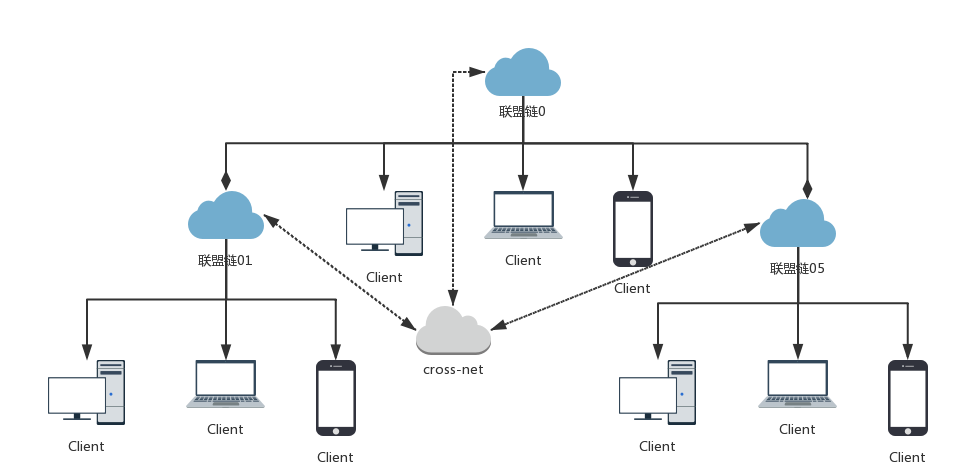
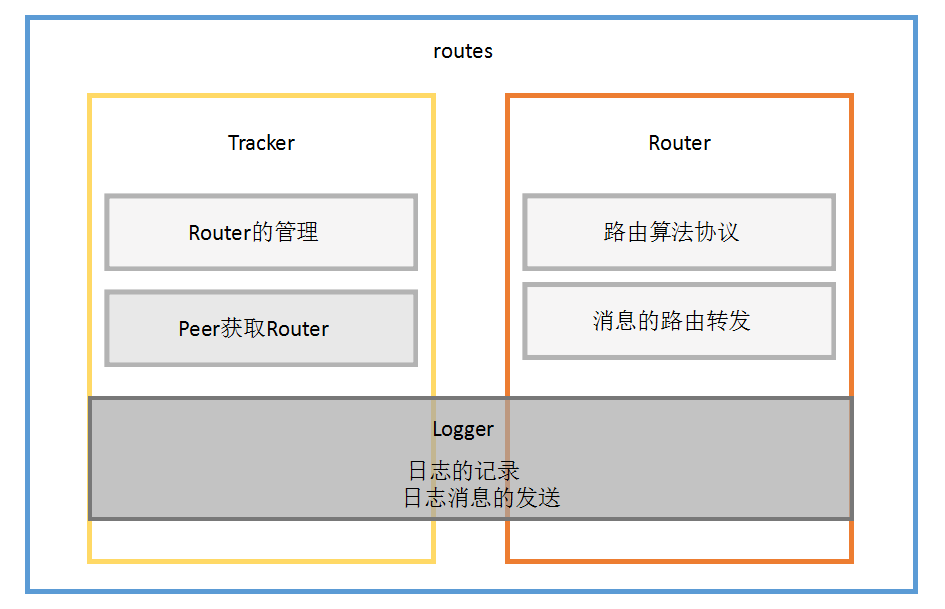
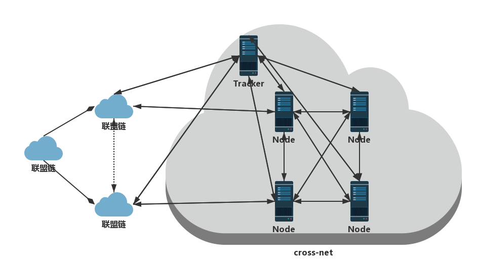

# 跨链路由协议routes

## 前言
跨链路由协议，主要用于包含链中链的联盟链不同链间的通信， 提供消息路由转发的功能。

### 目录
#### 1. 介绍
- 1.1 跨链
	
	为了提高联盟链的效率，使其能够满足现实中的交易吞吐量，将区块链进行拆分（链中链），减轻了区块链的压力，同时能够支持不同链的并发交易

- 1.2 为什么需要跨链通信

	在现实业务中，不同链间是需要直接交易，提高效率，降低成本

- 1.3 routes
	
	提供消息路由转发功能，解决跨链联盟链不同链间的消息通信，使得跨链交易的完成
	
	

#### 2. routes
- 2.1 架构

- 2.2 Router

	提供消息路由服务，可直连零到多个区块链节点。

	提供Router追踪服务，注册维护rounter列表， 提供与区块链节点的直连Router。
	
	通过路由算法可以获取到达目的地址的路由，使得直连节点与目的地址的节点进行通信
	
- 2.3 Peer
   
	联盟链的节点，从Tracker中获取与其直连Router， 通过Router与不同链的目的节点进行通信
	

#### 3. 协议
- 3.1 消息

		message Message {
				enum Type{
     				UNDEFINED = 0;

        			ROUTER_HELLO = 1;
        			ROUTER_HELLO_ACK = 2;
        			ROUTER_CLOSE = 3;
        			ROUTER_GET = 4;
        			ROUTER_GET_ACK = 5;        
        			ROUTER_SYNC = 6;

        			PEER_HELLO = 11;
        			PEER_HELLO_ACK = 12;
        			PEER_CLOSE = 13;      
        			PEER_SYNC = 14;

        			CHAIN_MESSAGE = 21;

        			KEEPALIVE =31;
        			KEEPALIVE_ACK = 32;
    			}
   			Type type = 1;
    		bytes payload = 2;
    		bytes metadata = 3;
		}

		message Router {
    		string id = 1;
    		string address = 2;
		}

		message Routers {
    		string id = 1;
    		repeated Router routers = 2;
		}

		message Peer {
    		string id = 1;
		}

		message Peers {
    		string id = 1;
    		repeated Peer peers = 2;
		}

		message ChainMessage {
    		string srcId = 1;
    		string dstId = 2;
    		bytes payload = 3;
    		bytes signature = 4;
		}